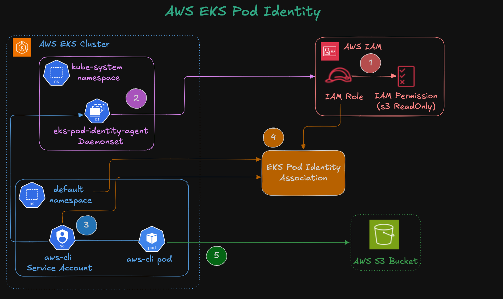

# Amazon EKS Pod Identity Agent - Demo

## Amazon EKS Pod Identity – High-Level Flow
Amazon EKS Pod Identity enables pods in your cluster to securely assume IAM roles without managing static credentials or using IRSA annotations. The high-level flow is shown below:




## Step-00: What we’ll do
In this demo, we’ll understand and implement the **Amazon EKS Pod Identity Agent (PIA)**.

1. Install the **EKS Pod Identity Agent** add-on  
2. Create a **Kubernetes AWS CLI Pod** in the EKS Cluster and attempt to list S3 buckets (this will fail initially)  
3. Create an **IAM Role** with trust policy for Pod Identity → allow Pods to access **Amazon S3**  
4. Create a **Pod Identity Association** between the Kubernetes Service Account and IAM Role  
5. Re-test from the AWS CLI Pod, successfully list S3 buckets  
6. Through this flow, we will clearly understand how **Pod Identity Agent** works in EKS  

---

## Step-01: Install EKS Pod Identity Agent
1. Open **EKS Console** → **Clusters** → select your cluster (`eksdemo1`)  
2. Go to **Add-ons** → **Get more add-ons**  
3. Search for **EKS Pod Identity Agent**  
4. Click **Next** → **Create**  

This installs a **DaemonSet** (`eks-pod-identity-agent`) that enables Pod Identity associations.

```yaml
# List k8s PIA Resources
kubectl get daemonset -n kube-system

# List k8s Pods
kubectl get pods -n kube-system
```

---

## Step-02: Deploy AWS CLI Pod (without Pod Identity Association)
### Step-02-01: Create Service Account 
- ![service_account.yaml]
```yaml
apiVersion: v1
kind: ServiceAccount
metadata:
  name: aws-cli-sa
  namespace: default
```

### Step-02-02: Create a simple Kubernetes Pod with AWS CLI image:
- ![aws_cli_pod.yaml]
```yaml
apiVersion: v1
kind: Pod
metadata:
  name: aws-cli
  namespace: default
spec:
  serviceAccountName: aws-cli-sa
  containers:
  - name: aws-cli
    image: amazon/aws-cli
    command: ["sleep", "infinity"]
```

### Step-02-03: Deploy CLI Pod
```bash
kubectl apply -f kube-manifests/
kubectl get pods
```

### Step-02-04: Exec into the pod and try to list S3 buckets:
```bash
kubectl exec -it aws-cli -- aws s3 ls
```

**Observation:** ❌ This should **fail** because no IAM permissions are associated with the Pod.  

#### Error Message
```
kalyan-mini2:04-00-EKS-Pod-Identity-Agent kalyan$ kubectl exec -it aws-cli -- aws s3 ls

An error occurred (AccessDenied) when calling the ListBuckets operation: User: arn:aws:sts::180789647333:assumed-role/eksctl-eksdemo1-nodegroup-eksdemo1-NodeInstanceRole-kxEPBrWVcOzO/i-0d65729d6d09d2540 is not authorized to perform: s3:ListAllMyBuckets because no identity-based policy allows the s3:ListAllMyBuckets action
command terminated with exit code 254
```

**Important Note:**  Notice how the error references the **EC2 NodeInstanceRole** — this proves the Pod had no direct IAM mapping.

---

## Step-03: Create IAM Role for Pod Identity
1. Go to **IAM Console** → **Roles** → **Create Role**  
2. under Select trusted entity choose EKS and then EKS - Pod Identity 


3. Attach **AmazonS3ReadOnlyAccess** policy  
4. Create role → example name: `EKS-PodIdentity-S3-ReadOnly-Role-101`  

---

## Step-04: Create Pod Identity Association
* Go to **EKS Console** → Cluster → **Access** → **Pod Identity Associations**  
* Create new association:  

  * Namespace: `default`  
  * Service Account: `aws-cli-sa`  
  * IAM Role: `eks-pod-identity-role`  
  * Click on **create**  

---

## Step-05: Test Again

> Pods don’t automatically refresh credentials after a new Pod Identity Association; they must be restarted.

1. Restart Pod
```bash
# Delete Pod
kubectl delete pod aws-cli -n default

# Create Pod
kubectl apply -f kube-manifests/02_k8s_aws_cli_pod.yaml

# List Pods
kubectl get pods
```

2. Exec into the Pod:
```bash
# List S3 buckets
kubectl exec -it aws-cli -- aws s3 ls
```

**Observation:** This time it should **succeed**, listing all S3 buckets.

---

## Step-06: Clean Up

```bash
# 1. Delete the aws-cli pod
kubectl delete -f kube-manifests/
```

- **Remove Pod Identity Association** → via **EKS Console → Access → Pod Identity Associations**  
- **Remove IAM role** → via **IAM Console → Roles** 

---

## Step-07: Concept Recap

* **Without Pod Identity Association:** Pod has no IAM permissions → AWS API calls fail  
* **With Pod Identity Association:** Pod Identity Agent maps Pod’s Service Account → IAM Role → AWS Permissions → API calls succeed  

---


